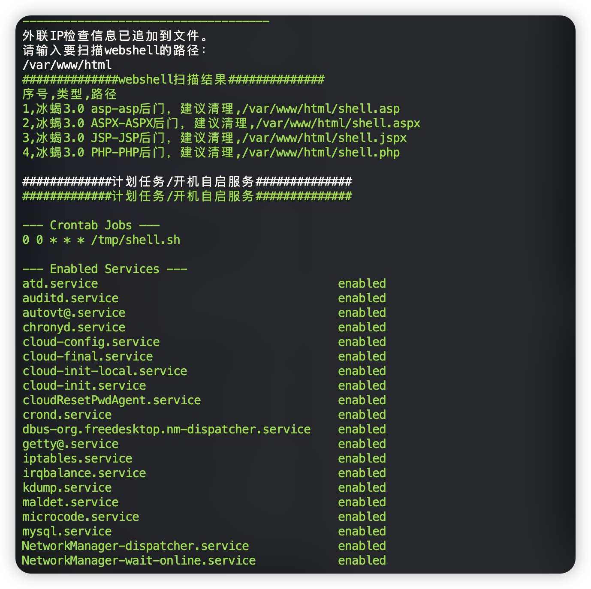

# LinuxScan

linux 自动化应急信息收集工具

支持联动微步分析外联IP是否为恶意IP，自动话webshell扫描，自动化分析恶意进程，文件上传修改，自动化日志分析


## 使用方法

```shell
./linuxScan
```


### 这里输入微步密钥


### 输入需要扫描webshell的路径 如网站路径



### 文件检查

​	输入需要检查的路径分析最近新增和修改的文件


### 账号登录日志分析


### 自动化分析web日志


### 自动化合规扫描


